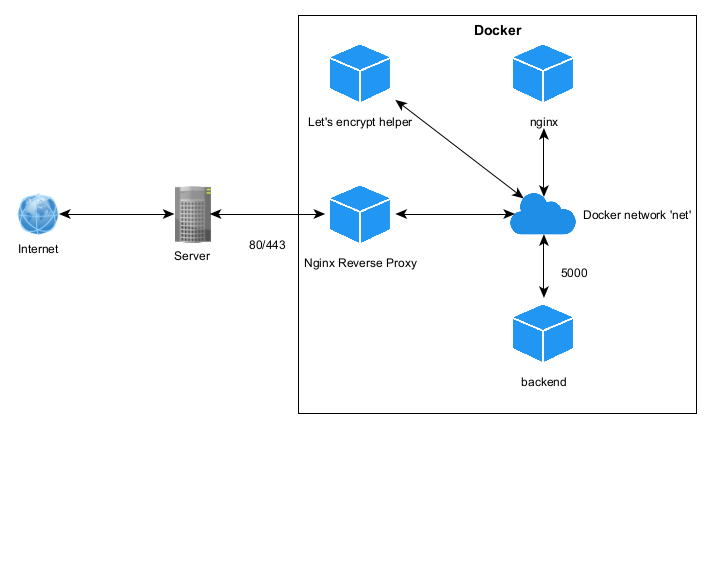

# Wiener Linien Störungsarchiv - Dokumentation Docker

Verfasser: **Leo Mühlböck**

Datum: **16.01.2023**

## Einführung

Dieser Teil der Dokumentation befasst sich spezifisch mit den verwendeten Dockerfiles und Docker-Containern.

Docker wird verwendet, um die Bereitstellung auf unterschiedlichen Systemen zu erleichtern und um sicherzustellen, dass alle Applikationen isoliert von anderen Programmen und dem Betriebssystem arbeiten, sowie Daten und Code voneinander zu trennen.

## Struktur

Die Docker-Container Struktur ist hier visualisiert:



Im Folgenden werden alle Teile etwas genauer beschrieben.

### Container `backend` -> `backend/Dockerfile`

#### Beschreibung

Dieser Container übernimmt die Störungsaufzeichnung und die API. Das Python-Skript `update_db.py` wird mittels cron alle 2 Minuten im Container ausgeführt. Die API wird über Gunicorn ausgeführt und über den Port 5000 in das Docker-Netzwerk weitergeleitet. 

#### Funktionsweise

Der Container basiert auf dem offiziellen Image für Python 3.10.8 auf dem Betriebssystem Debian Buster. Das Arbeitsverzeichnis liegt unter `/app`.

Die Datei `reqirements.txt`, die alle verwendeten Python-Module auflistet, wird zunächst in das Arbeitsverzeichnis kopiert. Dann werden alle Module mittels `pip install reqirements.txt` installiert. Dann wird das gesamte restliche Backend-Verzeichnis kopiert. 

Nachdem Python eingerichtet ist, wird Cron konfiguriert: Zunächst muss es über `apt-get` heruntergeladen und installiert werden, dann wird mit dem Umleitungsoperator `>>`  und dem Befehl `echo` eine neue Zeile in die Konfiguration `/etc/crontab` geschrieben:

```bash
echo "*/2 * * * * root cd /app && python3 update_db.py" >> /etc/crontab
```

Eine Schwierigkeit bestand darin, dass wenn das Python-Skript `update_db.py` über Cron ausgeführt wurde, wurde die falsche Zeitzone genommen (UTC statt CET). Das führte natürlich zu verfälschten Endzeiten bei den Störungen, da diese ja über die Systemzeit festgelegt wird. Gelöst wurde dieses Problem durch die manuelle Konfiguration der Zeitzone:

```bash
ln -sf /usr/share/zoneinfo/Europe/Vienna /etc/localtime
```

### Container `nginx` -> `nginx/Dockerfile`

#### Beschreibung

Dieser Container übernimmt die Bereitstellung ins Web mit Nginx. Das Frontend wird bei jedem Start des Containers gebuildet und über Nginx zugänglich gemacht. Die API wird über den Guicorn-Port am Pfad `/api` zugänglich gemacht.

#### Funktionsweise

Der Container besteht aus zwei Stages: Der Build-Stage und der Production-Stage.

- Build-Stage: Basierend auf dem offiziellen Image für NodeJS auf Alpine Linux, werden zunächst alle Package-JSON-Dateien ins Arbeitsverzeichnis `/app` kopiert und mit `npm install` werden dann alle benötigten Libraries installiert. Da hierbei ohne weiteres ein Fehler auftritt, muss vorher ein Befehl ausgeführt werden, um den Fehler zu beheben:

  ```bash
  npm config set legacy-peer-deps=true --location=project
  ```

  Nach der Installation wird das Ganze Frontend-Verzeichnis ins Arbeitsverzeichnis kopiert und mittels `npm run build`  wird das Frontend gebuilded.

- Production-Stage: Basierend auf dem offiziellen Nginx-Image wird das Frontend und die API mit Nginx bereitgestellt. Zunächst wird die Nginx-Konfiguration `nginx/nginx.conf` ins Verzeichnis `/etc/nginx` kopiert, dann wird der ganze `dist`-Ordner von der Build-Stage ins Verzeichnis `/var/www/html` kopiert. In der Nginx-Konfiguration wird zum einen der Pfad zum Frontend (`/var/www/html`) definiert, und zum anderen am Endpunkt `/api` einen Proxy-Pass zum Port 5000 im Docker-internen Netzwerk.

### Nginx Reverse Proxy & Let's encrypt helper

#### Beschreibung

Der Reverse Proxy Container sorgt dafür, dass Anfragen von außen an die jeweiligen Nginx-Server Container weitergeleitet werden bzw. Responses nach außen geleitet werden. In diesem Fall verbindet er also den Container nginx mit dem Internet. Der Let's encrypt helper Container sorgt dafür, dass immer ein aktuelles SSL-Zertifikat für die Nginx-Container vorliegt, sodass die HTTPS-Website ohne Sicherheitswarnung aufgerufen werden kann.

#### Funktionsweise

https://linuxhandbook.com/nginx-reverse-proxy-docker/

### Zusammenschluss der Container mit Compose -> `docker-compose.yml`

Alle Container und deren Verbindungen werden im Docker-Compose-File definiert. 

- `backend`: Das Dockerfile `backend/Dockerfile` wird definiert.

  Beim Start des Containers wird sowohl Cron als auch Gunicorn gestartet:

  ```bash
  service cron start
  ```

  ```bash
  gunicorn --workers 4 --bind 0.0.0.0:5000 wsgi:app
  ```

  Die Datenbank in `/app/data.db` wird als Volume definiert, sodass die Datenbank auch nach Neustart des Containers vorhanden bleibt.

  Der Port 5000 wird exposed, damit er im Docker-internen Netzwerk erreichbar ist.

- `nginx`: Das Dockerfile `nginx/Dockerfile` wird definiert.

  Die Environment-Variablen `VIRTUAL_HOST`, `LETSENCRYPT_HOST` und `VIRTUAL_PORT` werden definiert, für den Reverse-Proxy und den Let's encrypt helper.